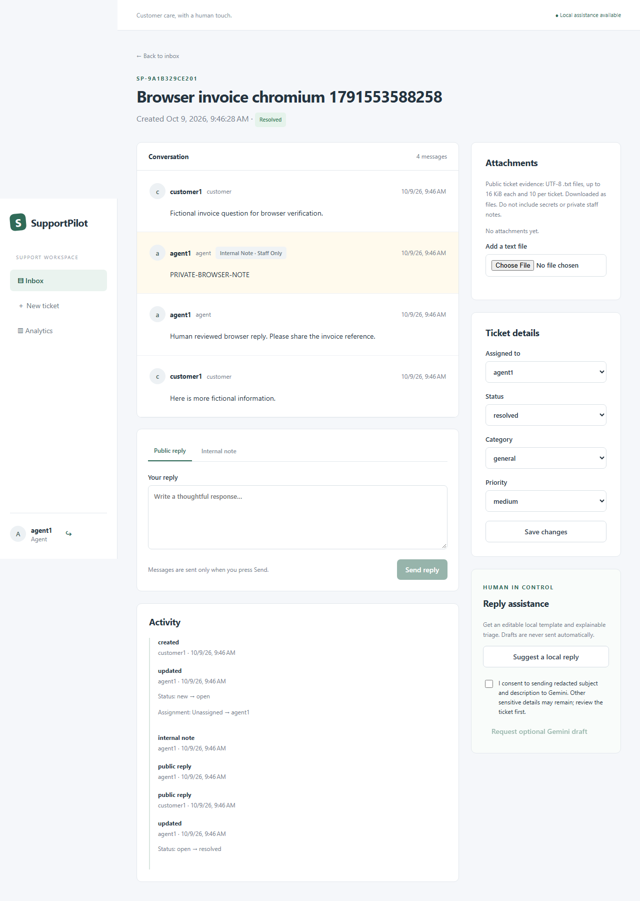
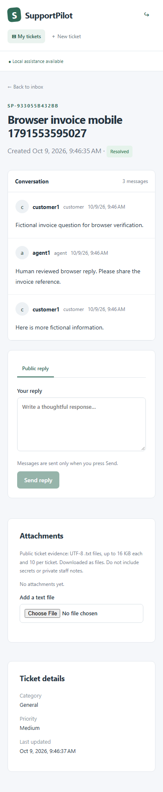

# SupportPilot — AI-Assisted Customer Support Platform

An Angular 21 + Express/TypeScript support workspace backed by real MongoDB. Customers follow their own conversations; agents assign, reply, add private notes and resolve tickets; administrators manage access. Explainable local triage and editable reply templates work **without an AI key or paid API**. Optional Gemini drafts require configuration and consent, and never send themselves.

## Features

- Salted scrypt passwords, hashed opaque cookie sessions, logout/revocation, origin + CSRF checks, login throttling and server role/ownership enforcement.
- Transactional tickets, public replies, internal notes and append-only audit events, explicit lifecycle rules and optimistic version conflicts.
- Search, status/priority filters, assigned/unassigned views, sorting, pagination, persisted unread markers and configurable overdue reminders.
- Authenticated Socket.IO WebSockets: only scoped invalidation IDs; private notes and drafts never broadcast to customers.
- Whole-word classification with explanations, competing-category hints and human overrides. Local templates and separately stored/reviewed drafts.
- Real MongoDB analytics: status/category totals, UTC daily volume, backlog and response/resolution averages; safe staff CSV exports.
- Admin account provisioning, roles, activation/deactivation, session revocation and reminder settings.
- Private storage and authorized download of public ticket .txt attachments (16 KiB, 10 per ticket).
- Responsive desktop/mobile controls, labeled forms, focus styles, loading/error/empty states and plain-text rendering.

## Quick local run (no Docker required)

Prerequisite: **Node 22.13.1 or newer compatible Node 22**, npm and internet access for the first dependency/MongoDB binary download.

```powershell
npm ci
npm run dev:isolated
```

This starts a **real disposable MongoDB replica set**, seeds 6 fictional accounts and 12 tickets, then starts the API on `http://127.0.0.1:3000`. It prints a generated local-only password. Data is discarded on shutdown. Keep this terminal open. In another terminal:

```powershell
npm run dev:frontend
```

Open **http://127.0.0.1:4200** (use this hostname consistently). Accounts: `admin@example.test`, `agent1@example.test`, `agent2@example.test`, `customer1@example.test`, `customer2@example.test`, `customer3@example.test`. Use the password printed by the isolated runner. Do not expose this demo to the public internet.

## Persistent local MongoDB with Docker

```powershell
npm ci
docker compose up -d --wait
Copy-Item backend/.env.example backend/.env
```

Set `SEED_PASSWORD` in `backend/.env` to a unique local-only password of at least 12 characters; never commit that file. Then:

```powershell
npm run seed
npm run dev:backend
```

Start `npm run dev:frontend` in another terminal. The seed refuses to overwrite existing accounts and is disabled in production. Compose enables `rs0` because ticket/message/audit transactions require a replica set. MongoDB data persists in the named volume. `docker compose down` preserves it. To use an existing replica set, configure `MONGODB_URI` instead.

For a non-demo initial administrator, set `ADMIN_EMAIL`, `ADMIN_PASSWORD` (12+ characters), and optionally `ADMIN_NAME` in backend environment, then run `npm run bootstrap-admin -w backend`. It refuses to overwrite an existing admin. Remove bootstrap credentials afterward; provision other users through the admin screen.

## Verify

```powershell
npm run build
npm run lint
npm run test
npx playwright install chromium
npm run e2e
npm audit
```

Backend tests use their own isolated MongoDB 8.0.12 replica set; browser tests create a separate database and generated credentials, start both applications, and exercise desktop plus 390px mobile flows. They never use your configured database. Initial MongoDB/browser downloads need network access. Linux browser prerequisites: `npx playwright install --with-deps chromium`.

Verified locally on Windows/Node 22.13.1: both production builds, ESLint, 20 backend unit/API/socket tests, 6 Angular interaction tests, and 4 Playwright desktop/mobile journeys passed. Dependency audit: zero vulnerabilities at the recorded release check. See [progress](docs/PROGRESS.md) for exact runs, fixes and commit history. GitHub Actions is configured; its remote outcome must be checked separately.

## Optional Gemini

Local mode is default: `AI_PROVIDER=local`, `AI_ENABLED=false`. To opt in, configure backend-only `AI_PROVIDER=gemini`, `AI_ENABLED=true`, `GEMINI_API_KEY` and `GEMINI_MODEL` with your own supported model/account. Check your provider's terms, quotas and pricing first. Staff must explicitly consent on each request; only redacted subject/description are sent. Redaction is heuristic, so review text for other sensitive details. Errors, invalid JSON and timeouts fall back to local drafts. Approval copies a draft to the editable composer; **only Send reply creates a public message**. Live Gemini calls were not tested without credentials; fallback and consent were tested with mocks.

## Screenshots from verified browser runs





## Documentation

- [API reference](docs/API.md): payloads, permissions, errors, sockets and lifecycle.
- [Architecture](docs/ARCHITECTURE.md) and [engineering decisions](docs/ENGINEERING_DECISIONS.md).
- [Demo walkthrough](docs/DEMO.md), [acceptance package](docs/ACCEPTANCE_AND_DEMO.md), [progress](docs/PROGRESS.md).
- Original [project reference](docs/PROJECT_REFERENCE.md), [60-step roadmap](docs/COMMIT_ROADMAP.md) and [interview notes](docs/INTERVIEW_NOTES.md) are preserved.

## Deployment and limits

Build with `npm run build`; serve `frontend/dist/browser` with SPA fallback and proxy `/api` + WebSocket `/socket.io` to `node backend/dist/server.js`. Node binds loopback; use a same-host reverse proxy with TLS. Set backend `NODE_ENV=production`, exact public `APP_ORIGIN`, and a secured replica-set MongoDB URI. Configure secrets only on the server. Local Compose is not production database configuration.

This release is a single workspace/process portfolio app. No email ingestion/delivery, multi-tenancy, binary attachments, malware scanner or enterprise SLA. Ticket and user lists are paginated; conversation/activity threads load in full. CSV caps at 10,000 rows. Rate limits use process-local IP storage; distributed deployments need shared adapters. Reopening clears current resolution time. Session expiry sockets disconnect within 5 seconds. Cloud fallback is verified; no live Gemini availability or pricing claim is made.

The 60 logical roadmap steps were grouped into fewer working, tested increments rather than filler commits. Existing history and actual timestamps are preserved; the exact count is in the progress log and final report.
