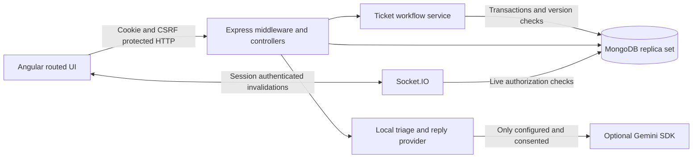

# Architecture

Frontend features: login, ticket inbox/composer/conversation, staff controls and draft review, analytics, admin users/settings. `core/api.ts` centralizes typed HTTP calls, session restore, guards, credentials and socket refresh signals. Lazy routes reduce initial payload.

Backend: `app.ts` sets middleware and centralized errors; `server.ts` opens MongoDB and HTTP/socket connections. `controllers/api.ts` validates HTTP payloads and dispatches operations. `services/tickets.ts` owns ownership and transactional lifecycle rules; `services/triage.ts` owns deterministic suggestions, privacy minimization and optional cloud fallback. Account/session provisioning, analytics aggregation and transactional attachment rules live in `services/accounts.ts`, `services/analytics.ts` and `services/attachments.ts`. `middleware/security.ts` supplies identity, password/session utilities and role/CSRF enforcement. `models/index.ts` defines schemas and indexes. `seed.ts` provisions fictional local data without overwriting existing accounts; `bootstrap-admin.ts` creates a non-demo initial administrator.

Collections: User, Session (TTL), Ticket, Message (public/internal), TicketEvent, Draft (7-day TTL), ReadState, Settings, Attachment. Indexes support unique emails/numbers, customer chronology, assignment/status, ticket message/event chronology, session tokens and read-state uniqueness. Message/event history is unpaginated within a ticket in this portfolio release; ticket lists and users are paginated.

For deployment, use a replica-set MongoDB, TLS termination and a same-origin reverse proxy routing `/api` and `/socket.io` to Node and other routes to Angular `index.html`. Configure `APP_ORIGIN` exactly. Node binds localhost by default; put the reverse proxy on the same host. Keep environment secrets out of the frontend and Git. Docker Compose is local-only (loopback port, no public database credentials), not a production database configuration.

Known scaling limits: one workspace, one API process, in-memory IP rate limiting, polling session expiry, full ticket threads, and 10,000-row CSV limit. Attachment uploads serialize through the ticket and write their audit event transactionally. No email delivery, external inbox ingestion, autonomous replies or real-world SLA guarantee.
